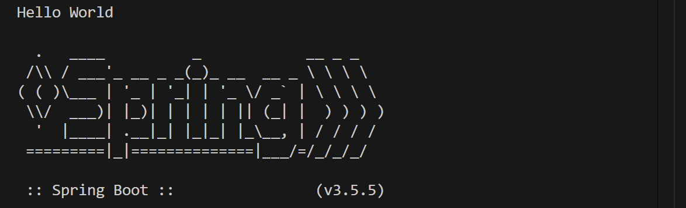
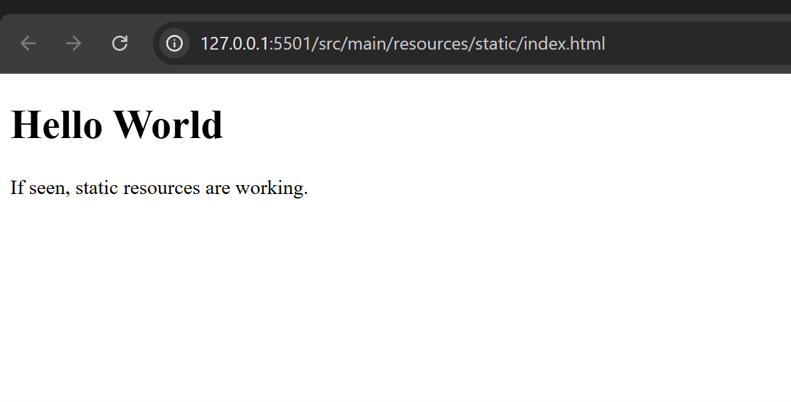
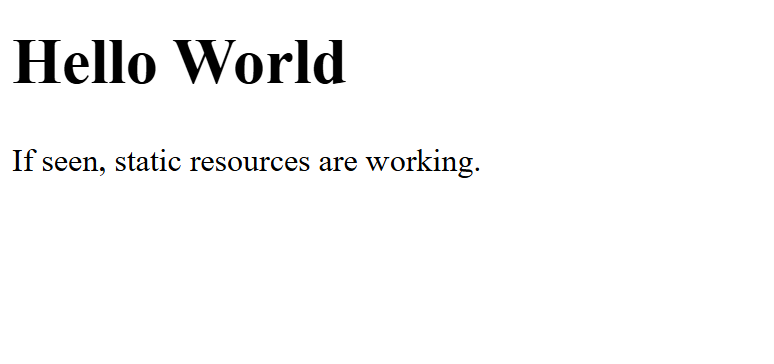

# CST-339 Activity 1  
**Devin Puckett**  
Professor Bobby Estey  

---

## Part 1: Tools Installation and Validation  

### Overview  
In this activity, you will install the latest version of the Spring Tool Suite and validate your local environment by developing a simple "Hello World" Spring Boot application. Note, these activities are written assuming the use of the Spring Tool Suite IDE. With approval from your instructor, you are free to explore the use of Microsoft Visual Studio Code IDE in this course as long as you are comfortable with finding alternative steps to complete the activities.  

### Execution  
Execute this assignment according to the following guidelines:  

1. Download the latest version of Spring Tool Suite as outlined in Class Resources.  
2. Download and install the latest Java SE Development Kit (JDK).  
3. Create a default Spring Boot application named `topic1` that displays "Hello World".  

### Deliverables  

- Screenshot of Spring Tool Suite About Box  
    
  This screenshot shows the About Box in Spring Tool Suite. It proves that I installed the correct version and the IDE is ready for development.  

- Screenshot of Java version installed  
    
  Here I ran the `java -version` command. It confirms that the Java JDK is set up correctly on my computer and matches what the activity asked for.  

- Screenshot of "Hello World" Spring Boot application output  
    
  This output shows my Spring Boot project named `topic1` running in the console. The message “Hello World” displays, which means my application built and executed successfully.  

  Here is the Java code I used for the Hello World program:

  ```java
  package com.example.topic1;

  import org.springframework.boot.SpringApplication;
  import org.springframework.boot.autoconfigure.SpringBootApplication;

  @SpringBootApplication
  public class Topic1Application {
      public static void main(String[] args) {
          SpringApplication.run(Topic1Application.class, args);
          System.out.println("Hello World");
      }
  } 

---

## Part 2: Learning Maven  

### Overview  
This part of the activity introduces Maven, a build automation tool used for managing project dependencies and builds.  

### Execution  
1. Review Maven basics and its role in Java project builds.  
2. Use Maven within your Spring project to build and run the application.  
3. Take a screenshot showing a successful Maven build and run.  

### Deliverables  

- Screenshot of Maven build and run  
    
  This screenshot shows Maven successfully building and running my project. It verifies that I was able to use Maven to handle the build process and that everything compiled without errors.  

  Example of the Maven pom.xml file created by Spring Initializr:

<project xmlns="http://maven.apache.org/POM/4.0.0"
         xmlns:xsi="http://www.w3.org/2001/XMLSchema-instance"
         xsi:schemaLocation="http://maven.apache.org/POM/4.0.0 
                             http://maven.apache.org/xsd/maven-4.0.0.xsd">
    <modelVersion>4.0.0</modelVersion>
    <groupId>com.example</groupId>
    <artifactId>topic1</artifactId>
    <version>0.0.1-SNAPSHOT</version>
    <packaging>jar</packaging>
    <name>topic1</name>
    <description>Spring Boot Hello World Project</description>
    <parent>
        <groupId>org.springframework.boot</groupId>
        <artifactId>spring-boot-starter-parent</artifactId>
        <version>3.5.5</version>
    </parent>
    <dependencies>
        <dependency>
            <groupId>org.springframework.boot</groupId>
            <artifactId>spring-boot-starter</artifactId>
        </dependency>
    </dependencies>
</project>

---